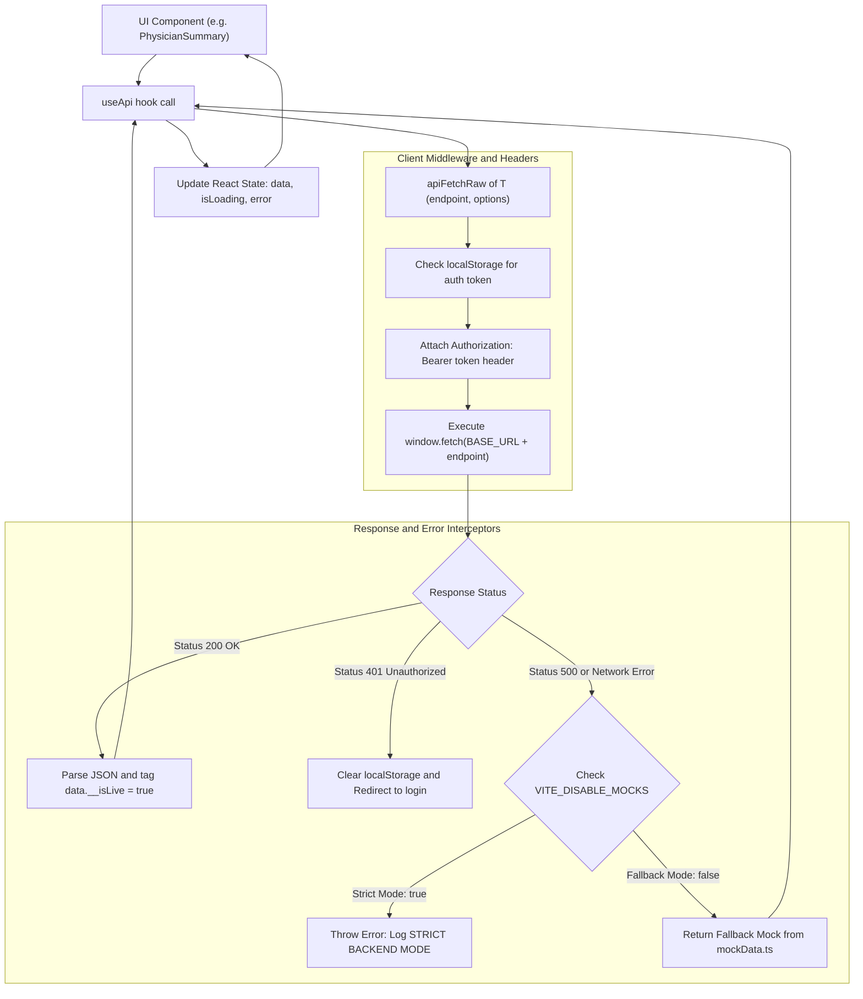

# SleepCare Dashboard — API & Backend Service Architecture

> **Primary Service Implementations:**  
> - Core API Engine: [`src/app/data/api.ts`](file:///c:/Users/mahmed/Downloads/SleepCare-Dashboard/src/app/data/api.ts)  
> - Telemetry Client: [`src/app/services/telemetryApi.ts`](file:///c:/Users/mahmed/Downloads/SleepCare-Dashboard/src/app/services/telemetryApi.ts)  
> - Telemetry Type Definitions: [`src/app/types/telemetry.ts`](file:///c:/Users/mahmed/Downloads/SleepCare-Dashboard/src/app/types/telemetry.ts)  
> - Mock Fallback Data: [`src/app/data/mockData.ts`](file:///c:/Users/mahmed/Downloads/SleepCare-Dashboard/src/app/data/mockData.ts)

---

## 1. End-to-End Communication Architecture

All HTTP operations pass through a unified client pipeline in [`src/app/data/api.ts`](file:///c:/Users/mahmed/Downloads/SleepCare-Dashboard/src/app/data/api.ts):



---

## 2. Environment Variables & URL Resolution

Backend targets are resolved using Vite environment variables:

| Environment Variable | Default Fallback | Purpose |
|---|---|---|
| `VITE_API_URL` | `''` (relative to origin) | Base URL for FastAPI endpoints (e.g. `http://<BACKEND_VM_IP>` or `https://cpap-backend.onrender.com`) |
| `VITE_VIDEO_URL` | Defaults to `VITE_API_URL` | Dedicated video & WebVTT asset storage server (e.g. `http://<MEDIA_VM_IP>:8080`) |
| `VITE_DISABLE_MOCKS` | `'false'` | When `'true'`, turns off mock fallbacks entirely and fails loudly on API errors |

### Video & Media URL Normalization

Video paths returned by the backend may be relative or absolute. [`getFullVideoUrl`](file:///c:/Users/mahmed/Downloads/SleepCare-Dashboard/src/app/data/api.ts#L24-L33) formats them:

```typescript
export function getFullVideoUrl(url: string | null | undefined): string {
  if (!url || url.includes('mock.video')) {
    return 'https://www.w3schools.com/html/mov_bbb.mp4';
  }
  if (url.startsWith('http://') || url.startsWith('https://')) {
    return url;
  }
  const videoBase = import.meta.env.VITE_VIDEO_URL || BASE_URL;
  return `${videoBase}${url.startsWith('/') ? '' : '/'}${url}`;
}
```

---

## 3. Comprehensive API Endpoint Catalog

The table below catalogs every API endpoint invoked by the frontend:

| Service Function | Endpoint | Method | Purpose | Consumed By |
|---|---|---|---|---|
| [`checkHealth`](file:///c:/Users/mahmed/Downloads/SleepCare-Dashboard/src/app/data/api.ts#L804) | `/health` | GET | System health & heartbeat check | [`ConnectivityStatus`](file:///c:/Users/mahmed/Downloads/SleepCare-Dashboard/src/app/components/ui/ConnectivityStatus.tsx) |
| `login` (inline) | `/api/auth/login` | POST | Authenticates patient, physician, or technician | [`PatientLogin`](file:///c:/Users/mahmed/Downloads/SleepCare-Dashboard/src/app/pages/auth/PatientLogin.tsx), [`PhysicianLogin`](file:///c:/Users/mahmed/Downloads/SleepCare-Dashboard/src/app/pages/auth/PhysicianLogin.tsx), [`TechnicianLogin`](file:///c:/Users/mahmed/Downloads/SleepCare-Dashboard/src/app/pages/auth/TechnicianLogin.tsx) |
| `register` (inline) | `/api/auth/register` | POST | Registers new patient accounts | [`PatientSignup`](file:///c:/Users/mahmed/Downloads/SleepCare-Dashboard/src/app/pages/auth/PatientSignup.tsx) |
| [`fetchPatients`](file:///c:/Users/mahmed/Downloads/SleepCare-Dashboard/src/app/data/api.ts#L571) | `/api/patients` | GET | Fetches full patient directory list | [`PatientDirectory`](file:///c:/Users/mahmed/Downloads/SleepCare-Dashboard/src/app/pages/shared/Directory.tsx) |
| [`fetchPatientSummary`](file:///c:/Users/mahmed/Downloads/SleepCare-Dashboard/src/app/data/api.ts#L581) | `/api/patients/:id/summary` | GET | Retrieves clinical profile, risk score, adherence % | [`SummaryContent`](file:///c:/Users/mahmed/Downloads/SleepCare-Dashboard/src/app/components/SummaryContent.tsx), [`PatientLayout`](file:///c:/Users/mahmed/Downloads/SleepCare-Dashboard/src/app/layouts/PatientLayout.tsx), [`PhysicianPatientLayout`](file:///c:/Users/mahmed/Downloads/SleepCare-Dashboard/src/app/layouts/PhysicianPatientLayout.tsx) |
| [`fetchPhysicianQueue`](file:///c:/Users/mahmed/Downloads/SleepCare-Dashboard/src/app/data/api.ts#L598) | `/api/physician/queue` | GET | Urgent exception inbox and annual review lists | [`PhysicianHome`](file:///c:/Users/mahmed/Downloads/SleepCare-Dashboard/src/app/pages/physician/Home.tsx) |
| [`fetchTechnicianEvents`](file:///c:/Users/mahmed/Downloads/SleepCare-Dashboard/src/app/data/api.ts#L622) | `/api/technician/events` | GET | Live adverse therapy events (Leaks, usage drops) | [`TechnicianHome`](file:///c:/Users/mahmed/Downloads/SleepCare-Dashboard/src/app/pages/technician/Home.tsx) |
| [`fetchTechnicianQueue`](file:///c:/Users/mahmed/Downloads/SleepCare-Dashboard/src/app/data/api.ts#L612) | `/api/technician/queue` | GET | Technician prioritized dropout risk queue | [`TechnicianHome`](file:///c:/Users/mahmed/Downloads/SleepCare-Dashboard/src/app/pages/technician/Home.tsx) |
| [`submitEventTriage`](file:///c:/Users/mahmed/Downloads/SleepCare-Dashboard/src/app/data/api.ts#L817) | `/api/technician/events/:id/triage` | POST | Confirms (Validate) or dismisses an alert | [`TechnicianHome`](file:///c:/Users/mahmed/Downloads/SleepCare-Dashboard/src/app/pages/technician/Home.tsx) |
| [`fetchCpapTrends`](file:///c:/Users/mahmed/Downloads/SleepCare-Dashboard/src/app/data/api.ts#L636) | `/api/cpap/:id/trends?days=:days` | GET | Daily hours slept, leak curves, AHI, titrations | [`UniversalCPAP`](file:///c:/Users/mahmed/Downloads/SleepCare-Dashboard/src/app/pages/shared/UniversalCPAP.tsx), [`PatientHome`](file:///c:/Users/mahmed/Downloads/SleepCare-Dashboard/src/app/pages/patient/Home.tsx), [`PatientCPAP`](file:///c:/Users/mahmed/Downloads/SleepCare-Dashboard/src/app/pages/patient/CPAP.tsx) |
| [`fetchBiomarkers`](file:///c:/Users/mahmed/Downloads/SleepCare-Dashboard/src/app/data/api.ts#L647) | `/api/biomarkers/:id` | GET | Raw biomarker readings | [`UniversalBiomarkers`](file:///c:/Users/mahmed/Downloads/SleepCare-Dashboard/src/app/pages/shared/UniversalBiomarkers.tsx) |
| [`fetchBiomarkerOverview`](file:///c:/Users/mahmed/Downloads/SleepCare-Dashboard/src/app/data/api.ts#L658) | `/api/biomarkers/:id/overview` | GET | Aggregated sensor statistics and trends | [`UniversalBiomarkers`](file:///c:/Users/mahmed/Downloads/SleepCare-Dashboard/src/app/pages/shared/UniversalBiomarkers.tsx) |
| [`fetchWithingsData`](file:///c:/Users/mahmed/Downloads/SleepCare-Dashboard/src/app/data/api.ts#L669) | `/api/biomarkers/:id/withings` | GET | Withings ScanWatch data (HRV, Sleep, Steps) | [`UniversalBiomarkers`](file:///c:/Users/mahmed/Downloads/SleepCare-Dashboard/src/app/pages/shared/UniversalBiomarkers.tsx) |
| [`fetchMasimoData`](file:///c:/Users/mahmed/Downloads/SleepCare-Dashboard/src/app/data/api.ts#L680) | `/api/biomarkers/:id/masimo` | GET | Masimo Pulse Oximeter data (SpO₂, ODI, Pulse) | [`UniversalBiomarkers`](file:///c:/Users/mahmed/Downloads/SleepCare-Dashboard/src/app/pages/shared/UniversalBiomarkers.tsx) |
| [`fetchSleepData`](file:///c:/Users/mahmed/Downloads/SleepCare-Dashboard/src/app/data/api.ts#L691) | `/api/biomarkers/:id/sleep` | GET | SomnoArt EEG sleep staging (Deep, REM, WASO) | [`UniversalBiomarkers`](file:///c:/Users/mahmed/Downloads/SleepCare-Dashboard/src/app/pages/shared/UniversalBiomarkers.tsx) |
| [`fetchDevices`](file:///c:/Users/mahmed/Downloads/SleepCare-Dashboard/src/app/data/api.ts#L702) | `/api/patients/:id/devices` | GET | Hardware sensor device status and serials | [`TechnicianDevices`](file:///c:/Users/mahmed/Downloads/SleepCare-Dashboard/src/app/pages/technician/Devices.tsx), [`PatientInterventions`](file:///c:/Users/mahmed/Downloads/SleepCare-Dashboard/src/app/pages/patient/Interventions.tsx) |
| [`pairDevice`](file:///c:/Users/mahmed/Downloads/SleepCare-Dashboard/src/app/data/api.ts#L990) | `/api/patients/:id/devices/pair` | POST | Pairs a new hardware sensor or watch | [`TechnicianDevices`](file:///c:/Users/mahmed/Downloads/SleepCare-Dashboard/src/app/pages/technician/Devices.tsx) |
| [`unpairDevice`](file:///c:/Users/mahmed/Downloads/SleepCare-Dashboard/src/app/data/api.ts#L1005) | `/api/patients/:id/devices/:deviceId` | DELETE | Unpairs / removes a sensor device | [`TechnicianDevices`](file:///c:/Users/mahmed/Downloads/SleepCare-Dashboard/src/app/pages/technician/Devices.tsx) |
| [`runDeviceDiagnostic`](file:///c:/Users/mahmed/Downloads/SleepCare-Dashboard/src/app/data/api.ts#L1017) | `/api/patients/:id/devices/:deviceId/diagnostic` | POST | Triggers hardware self-test diagnostic | [`TechnicianDevices`](file:///c:/Users/mahmed/Downloads/SleepCare-Dashboard/src/app/pages/technician/Devices.tsx) |
| [`fetchInterventions`](file:///c:/Users/mahmed/Downloads/SleepCare-Dashboard/src/app/data/api.ts#L713) | `/api/patients/:id/interventions` | GET | Chronological history of clinical and logistical interventions | [`UniversalInterventions`](file:///c:/Users/mahmed/Downloads/SleepCare-Dashboard/src/app/pages/shared/UniversalInterventions.tsx), [`SummaryContent`](file:///c:/Users/mahmed/Downloads/SleepCare-Dashboard/src/app/components/SummaryContent.tsx) |
| [`createIntervention`](file:///c:/Users/mahmed/Downloads/SleepCare-Dashboard/src/app/data/api.ts#L847) | `/api/patients/:id/interventions` | POST | Logs a new medical order or dispatch action | [`SummaryContent`](file:///c:/Users/mahmed/Downloads/SleepCare-Dashboard/src/app/components/SummaryContent.tsx), [`UniversalInterventions`](file:///c:/Users/mahmed/Downloads/SleepCare-Dashboard/src/app/pages/shared/UniversalInterventions.tsx) |
| [`fetchAuthorizations`](file:///c:/Users/mahmed/Downloads/SleepCare-Dashboard/src/app/data/api.ts#L757) | `/api/patients/:id/authorizations` | GET | Digital prescriptions and medical pathway authorizations | [`UniversalInterventions`](file:///c:/Users/mahmed/Downloads/SleepCare-Dashboard/src/app/pages/shared/UniversalInterventions.tsx) |
| [`createAuthorization`](file:///c:/Users/mahmed/Downloads/SleepCare-Dashboard/src/app/data/api.ts#L862) | `/api/patients/:id/authorizations` | POST | Authorizes care transition (e.g. MAD/HNS therapy) | [`SummaryContent`](file:///c:/Users/mahmed/Downloads/SleepCare-Dashboard/src/app/components/SummaryContent.tsx), [`UniversalInterventions`](file:///c:/Users/mahmed/Downloads/SleepCare-Dashboard/src/app/pages/shared/UniversalInterventions.tsx) |
| [`submitClinicianOverride`](file:///c:/Users/mahmed/Downloads/SleepCare-Dashboard/src/app/data/api.ts#L975) | `/api/patients/:id/override` | POST | Logs clinician rejection of AI recommendation | [`SummaryContent`](file:///c:/Users/mahmed/Downloads/SleepCare-Dashboard/src/app/components/SummaryContent.tsx) |
| [`fetchWeeklyAnalysis`](file:///c:/Users/mahmed/Downloads/SleepCare-Dashboard/src/app/data/api.ts#L735) | `/api/patients/:id/analysis/weekly` | GET | Machine learning analysis, risk tiers, and next best action | [`UniversalAIAnalysis`](file:///c:/Users/mahmed/Downloads/SleepCare-Dashboard/src/app/pages/shared/UniversalAIAnalysis.tsx), [`SummaryContent`](file:///c:/Users/mahmed/Downloads/SleepCare-Dashboard/src/app/components/SummaryContent.tsx) |
| [`requestPatientSensing`](file:///c:/Users/mahmed/Downloads/SleepCare-Dashboard/src/app/data/api.ts#L960) | `/api/patients/:id/sensing-request` | POST | Triggers active sensor data sampling | [`UniversalAIAnalysis`](file:///c:/Users/mahmed/Downloads/SleepCare-Dashboard/src/app/pages/shared/UniversalAIAnalysis.tsx) |
| [`fetchSurveys`](file:///c:/Users/mahmed/Downloads/SleepCare-Dashboard/src/app/data/api.ts#L724) | `/api/patients/:id/surveys` | GET | Psychometric questionnaire history & pending surveys | [`UniversalSurveys`](file:///c:/Users/mahmed/Downloads/SleepCare-Dashboard/src/app/pages/shared/UniversalSurveys.tsx), [`PatientSurveys`](file:///c:/Users/mahmed/Downloads/SleepCare-Dashboard/src/app/pages/patient/Surveys.tsx) |
| [`submitSurveyResponse`](file:///c:/Users/mahmed/Downloads/SleepCare-Dashboard/src/app/data/api.ts#L928) | `/api/patients/:id/surveys/:surveyId` | POST | Submits patient answers to a survey | [`PatientSurveys`](file:///c:/Users/mahmed/Downloads/SleepCare-Dashboard/src/app/pages/patient/Surveys.tsx) |
| [`submitMonitoringLog`](file:///c:/Users/mahmed/Downloads/SleepCare-Dashboard/src/app/data/api.ts#L832) | `/api/patients/:id/monitoring` | POST | Clinician log of patient check-in | [`UniversalSurveys`](file:///c:/Users/mahmed/Downloads/SleepCare-Dashboard/src/app/pages/shared/UniversalSurveys.tsx) |
| [`fetchVideos`](file:///c:/Users/mahmed/Downloads/SleepCare-Dashboard/src/app/data/api.ts#L746) | `/api/patients/:id/videos` | GET | Assigned coaching video clips and packages | [`PatientHome`](file:///c:/Users/mahmed/Downloads/SleepCare-Dashboard/src/app/pages/patient/Home.tsx), [`PatientVideos`](file:///c:/Users/mahmed/Downloads/SleepCare-Dashboard/src/app/pages/patient/Videos.tsx) |
| [`logTraceInteraction`](file:///c:/Users/mahmed/Downloads/SleepCare-Dashboard/src/app/data/api.ts#L877) | `/api/telemetry/events/:eventId/interaction` | POST | Sends t8 (display), t9 (play), and t10 (ended) timestamps | [`useVideoTelemetry`](file:///c:/Users/mahmed/Downloads/SleepCare-Dashboard/src/app/hooks/useVideoTelemetry.ts) |
| [`submitVideoInteraction`](file:///c:/Users/mahmed/Downloads/SleepCare-Dashboard/src/app/data/api.ts#L893) | `/api/videos/:videoId/interaction` | POST | Records video watched status, seconds watched, star rating | [`useVideoTelemetry`](file:///c:/Users/mahmed/Downloads/SleepCare-Dashboard/src/app/hooks/useVideoTelemetry.ts), [`PatientVideos`](file:///c:/Users/mahmed/Downloads/SleepCare-Dashboard/src/app/pages/patient/Videos.tsx) |
| [`fetchLatencyKPIDashboard`](file:///c:/Users/mahmed/Downloads/SleepCare-Dashboard/src/app/data/api.ts#L910) | `/api/telemetry/reporting/latency-kpis` | GET | Audits distributed tracing timestamps & SLA pass rate | [`UniversalReporting`](file:///c:/Users/mahmed/Downloads/SleepCare-Dashboard/src/app/pages/shared/UniversalReporting.tsx) |
| [`fetchClinicianCohort`](file:///c:/Users/mahmed/Downloads/SleepCare-Dashboard/src/app/data/api.ts#L1110) | `/api/cohort/:id/reporting` | GET | Peer patient comparison cohort data for clinicians | [`UniversalReporting`](file:///c:/Users/mahmed/Downloads/SleepCare-Dashboard/src/app/pages/shared/UniversalReporting.tsx) |
| [`fetchPatientCohort`](file:///c:/Users/mahmed/Downloads/SleepCare-Dashboard/src/app/data/api.ts#L1130) | `/api/cohort/:id` | GET | Peer comparison data formatted for patient encouragement | [`PatientReporting`](file:///c:/Users/mahmed/Downloads/SleepCare-Dashboard/src/app/pages/patient/Reporting.tsx) |
| [`fetchPeerInterventions`](file:///c:/Users/mahmed/Downloads/SleepCare-Dashboard/src/app/data/api.ts#L1212) | `/api/cohort/:id/interventions` | GET | Success rates of interventions across peer sleepers | [`UniversalReporting`](file:///c:/Users/mahmed/Downloads/SleepCare-Dashboard/src/app/pages/shared/UniversalReporting.tsx), [`PatientReporting`](file:///c:/Users/mahmed/Downloads/SleepCare-Dashboard/src/app/pages/patient/Reporting.tsx) |
| [`fetchInventory`](file:///c:/Users/mahmed/Downloads/SleepCare-Dashboard/src/app/data/api.ts#L768) | `/api/inventory` | GET | Warehouse equipment inventory list | [`TechnicianInventory`](file:///c:/Users/mahmed/Downloads/SleepCare-Dashboard/src/app/pages/technician/Inventory.tsx) |
| [`addInventoryItem`](file:///c:/Users/mahmed/Downloads/SleepCare-Dashboard/src/app/data/api.ts#L1031) | `/api/inventory` | POST | Adds new item SKU to inventory | [`TechnicianInventory`](file:///c:/Users/mahmed/Downloads/SleepCare-Dashboard/src/app/pages/technician/Inventory.tsx) |
| [`reorderInventory`](file:///c:/Users/mahmed/Downloads/SleepCare-Dashboard/src/app/data/api.ts#L1045) | `/api/inventory/reorder` | POST | Places order for low-stock equipment | [`TechnicianInventory`](file:///c:/Users/mahmed/Downloads/SleepCare-Dashboard/src/app/pages/technician/Inventory.tsx) |
| [`fetchMaskHistory`](file:///c:/Users/mahmed/Downloads/SleepCare-Dashboard/src/app/data/api.ts#L779) | `/api/patients/:id/mask-history` | GET | Patient mask usage and replacement timeline | [`PatientInterventions`](file:///c:/Users/mahmed/Downloads/SleepCare-Dashboard/src/app/pages/patient/Interventions.tsx) |
| [`createSupportTicket`](file:///c:/Users/mahmed/Downloads/SleepCare-Dashboard/src/app/data/api.ts#L944) | `/api/patients/:id/support` | POST | Submits patient equipment support ticket | [`PatientHelp`](file:///c:/Users/mahmed/Downloads/SleepCare-Dashboard/src/app/pages/patient/Help.tsx) |
| [`fetchModels`](file:///c:/Users/mahmed/Downloads/SleepCare-Dashboard/src/app/data/api.ts#L1061) | `/api/models` | GET | Production AI model metadata and drift stats | [`AILifecyclePanel`](file:///c:/Users/mahmed/Downloads/SleepCare-Dashboard/src/app/components/AILifecyclePanel.tsx) |
| [`requestRetraining`](file:///c:/Users/mahmed/Downloads/SleepCare-Dashboard/src/app/data/api.ts#L1073) | `/api/models/:modelId/retrain` | POST | Requests background model retraining pipeline | [`AILifecyclePanel`](file:///c:/Users/mahmed/Downloads/SleepCare-Dashboard/src/app/components/AILifecyclePanel.tsx) |

### Aliases & Utility Functions

The following secondary methods and convenience aliases are also implemented in the service layer:

| Function | Endpoint / Target | Method | Purpose | Implementation Source |
|---|---|---|---|---|
| [`fetchPatient`](file:///c:/Users/mahmed/Downloads/SleepCare-Dashboard/src/app/data/api.ts#L718) | `/api/patients/:id` | GET | Direct patient record fetcher returning unformatted patient model | [`src/app/data/api.ts`](file:///c:/Users/mahmed/Downloads/SleepCare-Dashboard/src/app/data/api.ts) |
| [`fetchTriageEvents`](file:///c:/Users/mahmed/Downloads/SleepCare-Dashboard/src/app/data/api.ts#L627) | `/api/technician/events` | GET | Direct alias forwarding to `fetchTechnicianEvents` | [`src/app/data/api.ts`](file:///c:/Users/mahmed/Downloads/SleepCare-Dashboard/src/app/data/api.ts) |
| [`fetchInterventionsEffectiveness`](file:///c:/Users/mahmed/Downloads/SleepCare-Dashboard/src/app/data/api.ts#L1084) | `/api/patients/:id/interventions/effectiveness` | GET | Historical efficacy metrics for past clinical interventions | [`src/app/data/api.ts`](file:///c:/Users/mahmed/Downloads/SleepCare-Dashboard/src/app/data/api.ts) |
| [`logVideoCompletion`](file:///c:/Users/mahmed/Downloads/SleepCare-Dashboard/src/app/services/telemetryApi.ts#L35) | `/api/videos/:videoId/interaction` | POST | Convenience wrapper delegating to `submitVideoInteraction` | [`src/app/services/telemetryApi.ts`](file:///c:/Users/mahmed/Downloads/SleepCare-Dashboard/src/app/services/telemetryApi.ts) |

---

## 4. Distributed Tracing Telemetry Specification

The SleepCare platform captures precise timestamps to evaluate edge-to-cloud performance:

```
t0: Detected at Edge (Raspberry Pi)
t1: Sent by Edge Sensor
t2: Received at Local Gateway
t3: Processed at Gateway
t4: Pushed to Cloud VM
t5: Received at Cloud VM
t6: Persisted in SQL Server (DB_Clinical.telemetry.event_traces)
t7: Fetched by React Client
t8: Rendered / Displayed on Patient Screen (Time-to-Display KPI)
t9: Playback Initiated by Patient (Time-to-Play & Reaction Delay KPIs)
t10: Video Playback Completed (Trace Closed)
```

Payload schemas are strictly typed in [`src/app/types/telemetry.ts`](file:///c:/Users/mahmed/Downloads/SleepCare-Dashboard/src/app/types/telemetry.ts):

```typescript
export interface EventTraceInteractionUpdate {
  t7_fetched_at?: string | null;
  t8_displayed_at?: string | null;
  t9_played_at?: string | null;
  t10_completed_at?: string | null;
  watch_duration_seconds?: number | null;
}

export interface VideoInteractionUpdate {
  watched: boolean;
  watch_duration_seconds: number;
  rating?: number | null;
  t10_completed_at?: string | null;
}
```
