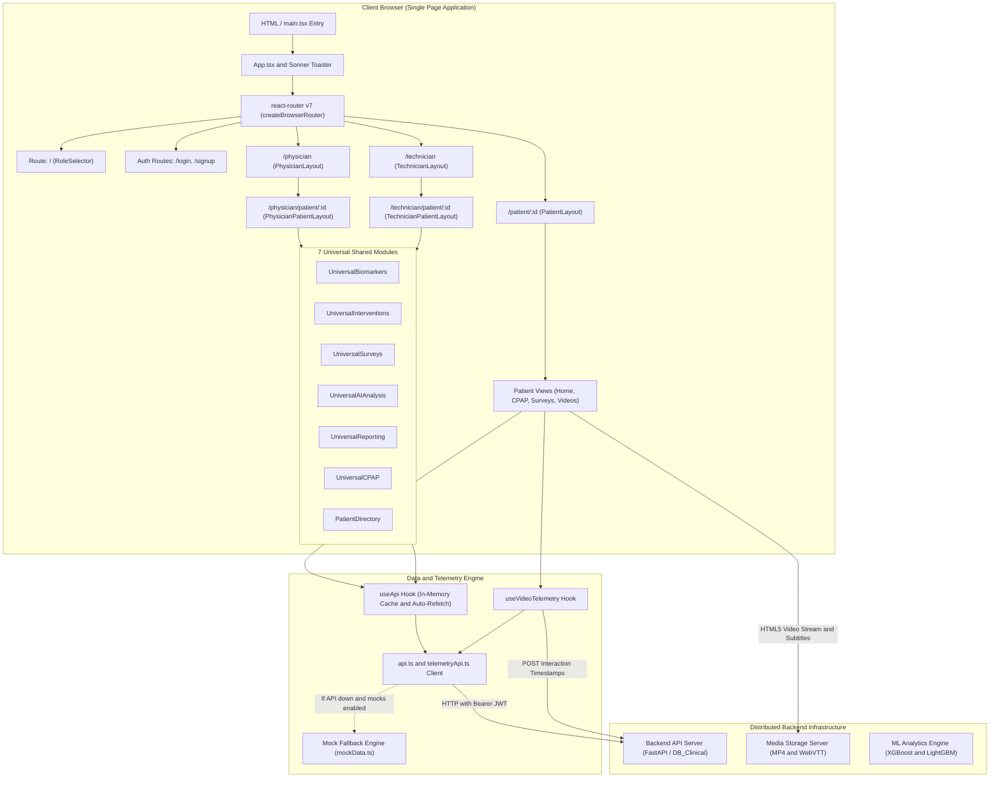
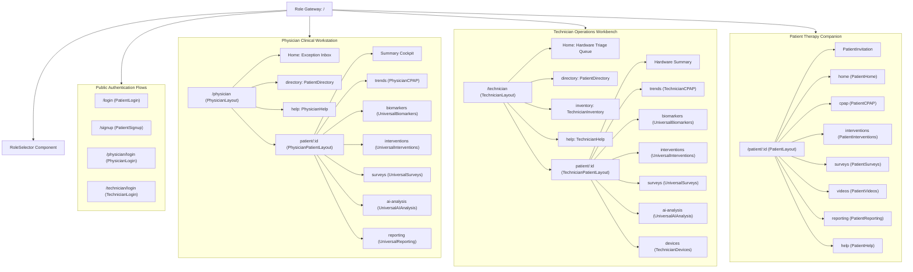
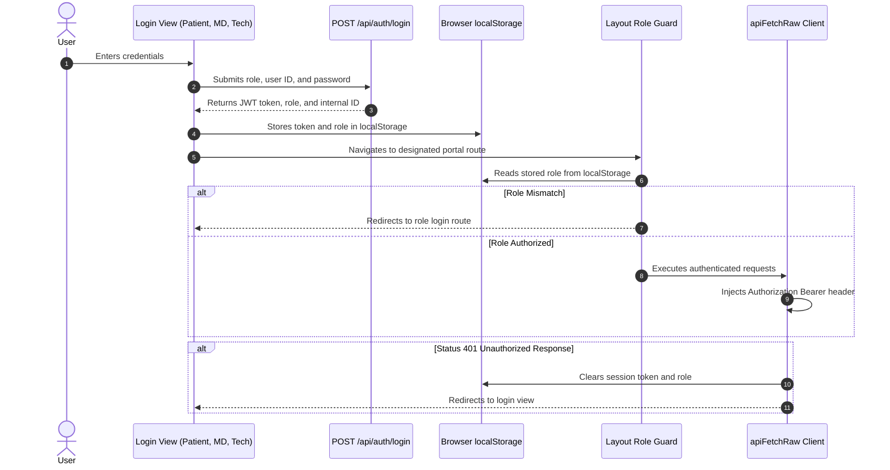
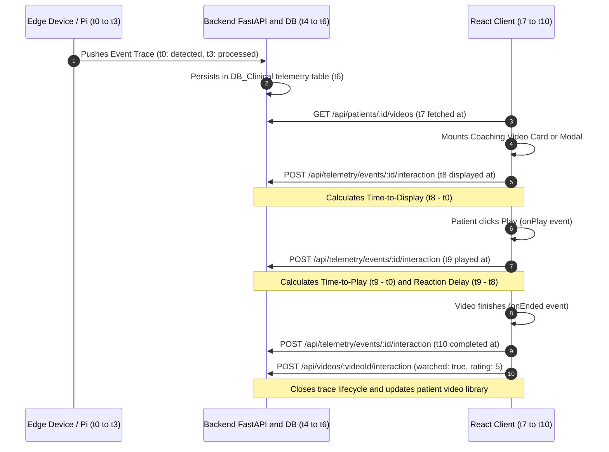

# SleepCare Dashboard — Frontend Architecture Overview

> **System:** SleepCare Clinical Telemonitoring Dashboard  
> **Consortium:** European 6G-PATH Consortium / Linde Homecare France / DISP Laboratory (Université Lumière Lyon 2 / Université Toulouse Capitole)  
> **Core Framework:** React 18/19, TypeScript 5, Vite 6, Tailwind CSS v4, React Router v7  
> **Source of Truth:** Workspace implementation at [`c:/Users/mahmed/Downloads/SleepCare-Dashboard/src`](file:///c:/Users/mahmed/Downloads/SleepCare-Dashboard/src)

---

## 1. High-Level Architectural Vision

The SleepCare Frontend is a multi-role, responsive clinical operations and telemonitoring dashboard built for the proactive management of **Obstructive Sleep Apnea (OSA)** patients undergoing **Continuous Positive Airway Pressure (CPAP)** therapy.

Traditional CPAP treatment suffers from a 40–50% dropout rate within the first 90 days due to preventable friction (mask leaks, high nasal resistance, improper pressure titration, and feeling unmonitored). SleepCare bridges this gap through three specialized portals powered by **7 polymorphic shared modules** and a distributed telemetry feedback loop:



---

## 2. Application Entry & Bootstrap Flow

The bootstrap chain executes without complex wrappers, preserving high runtime performance:

1. **[`index.html`](file:///c:/Users/mahmed/Downloads/SleepCare-Dashboard/index.html)**:
   - Root HTML skeleton containing `<div id="root"></div>`.
   - Directly imports the modern ESM entry module via `<script type="module" src="/src/main.tsx"></script>`.
2. **[`src/main.tsx`](file:///c:/Users/mahmed/Downloads/SleepCare-Dashboard/src/main.tsx)**:
   - Imports `createRoot` from `react-dom/client`.
   - Imports the global CSS tree via [`src/styles/index.css`](file:///c:/Users/mahmed/Downloads/SleepCare-Dashboard/src/styles/index.css).
   - Renders the root component [`<App />`](file:///c:/Users/mahmed/Downloads/SleepCare-Dashboard/src/app/App.tsx#L5-L12) into `document.getElementById("root")!`.
3. **[`src/app/App.tsx`](file:///c:/Users/mahmed/Downloads/SleepCare-Dashboard/src/app/App.tsx)**:
   - Mounts the `react-router` v7 provider: `<RouterProvider router={router} />`.
   - Mounts global notification toast engine: `<Toaster position="top-right" richColors closeButton />` from `sonner`.
   - Does not wrap the application in heavyweight Context providers; state is managed via URL params, in-memory API caching, and `localStorage`.

---

## 3. Router & Layout Hierarchy

Routing is defined declaratively using `createBrowserRouter` in [`src/app/routes.tsx`](file:///c:/Users/mahmed/Downloads/SleepCare-Dashboard/src/app/routes.tsx#L37-L125). The hierarchy organizes application workflows into distinct access tiers:



### Layout Responsibilities

| Layout File | Primary Responsibility | Key Elements |
|---|---|---|
| [`src/app/layouts/PatientLayout.tsx`](file:///c:/Users/mahmed/Downloads/SleepCare-Dashboard/src/app/layouts/PatientLayout.tsx) | Mobile-first companion shell for patients | Teal/sage gradient header, personalized greeting, live connectivity badge, bottom sticky navigation bar (7 tabs), sign-out action |
| [`src/app/layouts/PhysicianLayout.tsx`](file:///c:/Users/mahmed/Downloads/SleepCare-Dashboard/src/app/layouts/PhysicianLayout.tsx) | Clinical workstation sidebar frame | Role verification (`role === 'physician'`), left nav (Exception Inbox, Directory, Protocols), portal switcher, live backend monitor |
| [`src/app/layouts/PhysicianPatientLayout.tsx`](file:///c:/Users/mahmed/Downloads/SleepCare-Dashboard/src/app/layouts/PhysicianPatientLayout.tsx) | In-depth patient clinical cockpit header | Comprehensive patient banner: LISA tag, demographics, AHI, 95th% leak, Dropout Risk Score with progress bar, Care Phase pipeline (Onboarding / Optimization / Maintenance), sub-tab navigation bar |
| [`src/app/layouts/TechnicianLayout.tsx`](file:///c:/Users/mahmed/Downloads/SleepCare-Dashboard/src/app/layouts/TechnicianLayout.tsx) | Technical operations & inventory frame | Role verification (`role === 'technician'`), left nav (Priority Queue, Directory, Inventory Tracker, IT Support), amber operational branding |
| [`src/app/layouts/TechnicianPatientLayout.tsx`](file:///c:/Users/mahmed/Downloads/SleepCare-Dashboard/src/app/layouts/TechnicianPatientLayout.tsx) | Hardware, sensor pairing & logistics cockpit header | Hardware-oriented banner: Patient contact (phone/email), home address, machine serial number, mask model, sub-tab navigation including Biomarker Devices |

---

## 4. The 7 Polymorphic Shared Modules Architecture

A cornerstone of the SleepCare design is **role polymorphism**: instead of writing duplicate pages for Physicians and Technicians, the system utilizes shared components that adapt their UI controls, data queries, and actions based on the current user role or active route:

1. **[`UniversalBiomarkers`](file:///c:/Users/mahmed/Downloads/SleepCare-Dashboard/src/app/pages/shared/UniversalBiomarkers.tsx)**:
   - Aggregates multi-source physiological sensor streams: Withings ScanWatch (HRV, Sleep efficiency, Step count), Masimo Pulse Oximeter (SpO₂, ODI, Pulse rate, Perfusion Index), SomnoArt EEG (Deep sleep, REM, WASO, Awakenings), and Blood Pressure.
   - Interactive Recharts visualization with synchronized tooltips and clinical target thresholds.
2. **[`UniversalInterventions`](file:///c:/Users/mahmed/Downloads/SleepCare-Dashboard/src/app/pages/shared/UniversalInterventions.tsx)**:
   - Shared interventions timeline.
   - For **Physicians**: Shows clinical orders, medical pathway changes (App IAH titration, Mandibular Advancement Device MAD, Hypoglossal Nerve Stimulation HNS), and digital prescription signatures.
   - For **Technicians**: Shows equipment dispatch, physical sensor pairing, mask cushion replacements, and phone consults.
3. **[`UniversalSurveys`](file:///c:/Users/mahmed/Downloads/SleepCare-Dashboard/src/app/pages/shared/UniversalSurveys.tsx)**:
   - Full clinical psychometric survey engine: Epworth Sleepiness Scale (ESS, 0–24), Pittsburgh Sleep Quality Index (PSQI, 0–21), Insomnia Severity Index (ISI, 0–28), Fatigue Severity Scale (FSS), SF-36, and Beck Depression Inventory (BDI).
   - Features historical timeline, calendar heatmap, and question-by-question breakdown.
4. **[`UniversalAIAnalysis`](file:///c:/Users/mahmed/Downloads/SleepCare-Dashboard/src/app/pages/shared/UniversalAIAnalysis.tsx)**:
   - Visualizes machine learning compliance forecasts, dropout risk trajectories, and SHAP (SHapley Additive exPlanations) feature attributions (e.g. 95th percentile leak impact, night-to-night variance).
   - Provides a "Request Active Patient Sensing" trigger to initiate targeted wearable data streaming.
5. **[`UniversalReporting`](file:///c:/Users/mahmed/Downloads/SleepCare-Dashboard/src/app/pages/shared/UniversalReporting.tsx)**:
   - Peer cohort benchmarking: compares the patient against anonymous matched peers by age, mask type, and baseline risk.
   - Houses the **Distributed Telemetry & Latency KPI Dashboard** (`fetchLatencyKPIDashboard`), auditing system latency (Pi processing, VM push, network transit, Time-to-Display, Time-to-Play).
6. **[`UniversalCPAP`](file:///c:/Users/mahmed/Downloads/SleepCare-Dashboard/src/app/pages/shared/UniversalCPAP.tsx)**:
   - Polymorphic CPAP trend analyzer rendered via [`PhysicianCPAP`](file:///c:/Users/mahmed/Downloads/SleepCare-Dashboard/src/app/pages/physician/CPAP.tsx) and [`TechnicianCPAP`](file:///c:/Users/mahmed/Downloads/SleepCare-Dashboard/src/app/pages/technician/CPAP.tsx).
   - Displays 7/30/90-day daily usage hours with 4-hour CMS compliance reference line, 90th percentile mask leak curves, AHI index, and pressure settings.
7. **[`PatientDirectory`](file:///c:/Users/mahmed/Downloads/SleepCare-Dashboard/src/app/pages/shared/Directory.tsx)**:
   - Universal search and pagination table used at `/physician/directory` and `/technician/directory`.
   - Context-aware routing: clicking a patient row navigates to `/physician/patient/:id` or `/technician/patient/:id` depending on `location.pathname`.

---

## 5. Authentication & Authorization Lifecycle

Authentication is session-token based:



### Storage Keys

| Key | Format / Values | Purpose |
|---|---|---|
| `token` | String (JWT or session identifier) | Sent as `Authorization: Bearer <token>` on all API requests |
| `role` | `'patient' \| 'physician' \| 'technician'` | Used by layout components to restrict route access |
| `has-visited-*` | `'true' \| 'false'` | Patient portal onboarding progress tracking |
| `has-watched-video-*` | `'true' \| 'false'` | Local client-side video completion fallback |

> [!IMPORTANT]
> **Role Guard Enforcement Difference Across Layouts**:
> - [`PhysicianLayout`](file:///c:/Users/mahmed/Downloads/SleepCare-Dashboard/src/app/layouts/PhysicianLayout.tsx#L16-L21) and [`TechnicianLayout`](file:///c:/Users/mahmed/Downloads/SleepCare-Dashboard/src/app/layouts/TechnicianLayout.tsx#L17-L22) execute explicit mount-time role assertions via `useEffect` (`if (role !== 'physician') navigate('/physician/login')` and `if (role !== 'technician') navigate('/technician/login')`), immediately redirecting unauthorized sessions.
> - [`PatientLayout`](file:///c:/Users/mahmed/Downloads/SleepCare-Dashboard/src/app/layouts/PatientLayout.tsx) does **not** perform an equivalent mount-time role assertion; it relies on parameterized patient routing (`/patient/:id`) and the top-level `/patient -> /login` redirect in [`routes.tsx`](file:///c:/Users/mahmed/Downloads/SleepCare-Dashboard/src/app/routes.tsx#L122-L124), while providing credentials clearance upon explicit sign-out.

---

## 6. Distributed Telemetry & Tracing Integration

The application implements an end-to-end distributed telemetry loop connecting edge IoT devices (Raspberry Pi), cloud virtual machines, and the React frontend.

When an adverse therapy event occurs (e.g. Severe Mask Leak), an automated video coaching prescription is generated:



Implemented in:
- [`src/app/hooks/useVideoTelemetry.ts`](file:///c:/Users/mahmed/Downloads/SleepCare-Dashboard/src/app/hooks/useVideoTelemetry.ts)
- [`src/app/services/telemetryApi.ts`](file:///c:/Users/mahmed/Downloads/SleepCare-Dashboard/src/app/services/telemetryApi.ts)
- [`src/app/components/CoachingVideoModal.tsx`](file:///c:/Users/mahmed/Downloads/SleepCare-Dashboard/src/app/components/CoachingVideoModal.tsx)

---

## 7. Global Styling & Design Tokens

Styling leverages **Tailwind CSS v4** coupled with custom CSS custom properties defined in [`src/styles/theme.css`](file:///c:/Users/mahmed/Downloads/SleepCare-Dashboard/src/styles/theme.css):

```css
:root {
  --background: #FAFAFA;
  --foreground: #0A1128;
  --card: #ffffff;
  --primary: #0A1128;
  --accent: #2D9596;
  --destructive: #E76F51;
  --radius: 0.75rem;

  /* Custom Medical Theme Semantic Tokens */
  --navy: #0A1128;        /* Main headings & dark backgrounds */
  --teal: #2D9596;        /* Primary clinical accent / Physician branding */
  --amber: #F4A261;       /* Caution / Technician branding */
  --sage: #6A994E;        /* Therapy success / Compliant markers / Patient branding */
  --coral: #E76F51;       /* Clinical alerts / High-risk badges */
  --blue-gray: #414D5B;   /* Secondary typography */
  --slate-muted: #5A6B7C; /* Meta captions & borders */
  --light-blue: #E8EEF2;  /* Dividers & neutral card backgrounds */
}
```

Tailwind v4 is wired directly through `@tailwindcss/vite` in [`vite.config.ts`](file:///c:/Users/mahmed/Downloads/SleepCare-Dashboard/vite.config.ts#L31) and imported via `@import 'tailwindcss' source(none);` in [`src/styles/tailwind.css`](file:///c:/Users/mahmed/Downloads/SleepCare-Dashboard/src/styles/tailwind.css).
