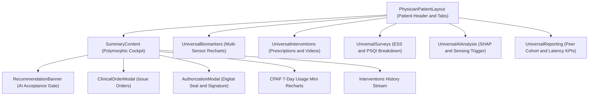
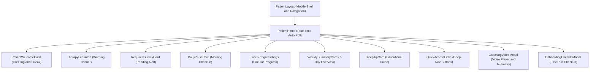

# SleepCare Dashboard — Component Architecture & Relationships

> **Core Component Directories:**  
> - Shared Feature Components: [`src/app/components/`](file:///c:/Users/mahmed/Downloads/SleepCare-Dashboard/src/app/components/)  
> - Patient Home Cards: [`src/app/pages/patient/components/`](file:///c:/Users/mahmed/Downloads/SleepCare-Dashboard/src/app/pages/patient/components/)  
> - Reusable UI Primitives (Radix/Shadcn): [`src/app/components/ui/`](file:///c:/Users/mahmed/Downloads/SleepCare-Dashboard/src/app/components/ui/)

---

## 1. Component Relationship Hierarchies

### A. Physician Patient Cockpit Tree



### B. Patient Companion Home Tree



---

## 2. Deep Dive: Key Feature Components

### 1. `SummaryContent`
- **Location**: [`src/app/components/SummaryContent.tsx`](file:///c:/Users/mahmed/Downloads/SleepCare-Dashboard/src/app/components/SummaryContent.tsx)
- **Purpose**: Central polymorphic clinical workbench component. Adapts controls depending on whether viewed by a Physician or Technician.
- **Used by**:
  - [`PhysicianSummary`](file:///c:/Users/mahmed/Downloads/SleepCare-Dashboard/src/app/pages/physician/Summary.tsx)
  - [`TechnicianSummary`](file:///c:/Users/mahmed/Downloads/SleepCare-Dashboard/src/app/pages/technician/Summary.tsx)
  - [`VisitPrepCard`](file:///c:/Users/mahmed/Downloads/SleepCare-Dashboard/src/app/components/VisitPrepCard.tsx)
- **Props**:
  ```typescript
  interface SummaryContentProps {
    patientId?: string;
    isCompact?: boolean;
    role?: 'physician' | 'technician';
    hideHeader?: boolean;
    showActions?: boolean;
  }
  ```
- **Internal State**:
  - `activePathway`: `'app_iah' | 'alt_therapy'`
  - `selectedTherapy`: string
  - `clinicalNotes`, `appIahNotes`: string
  - `gateStatus`: `'pending' | 'accepted' | 'rejected'`
  - `showRejectMenu`: boolean
  - `rejectReason`: string (`'contraindication' | 'patient_preference' | 'insufficient_data' | 'other'`)
  - `showOrderModal`: boolean
- **Hooks**: `useApi` (for summary, weekly analysis, 7-day CPAP trends, interventions), `useParams`.
- **API Dependencies**:
  - `fetchPatientSummary`
  - `fetchWeeklyAnalysis`
  - `fetchCpapTrends`
  - `fetchInterventions`
  - `createIntervention`
  - `createAuthorization`
  - `submitClinicianOverride`
- **Important Behavior**:
  - Renders the human-in-the-loop clinical acceptance gate. When an AI recommendation is rejected, prompts for clinical justification and submits an override log to the backend.
  - Switches action sets: Physicians see Clinical Orders and Alternative Therapy prescription workflows; Technicians see hardware dispatch and sensor troubleshooting actions.

---

### 2. `CoachingVideoModal`
- **Location**: [`src/app/components/CoachingVideoModal.tsx`](file:///c:/Users/mahmed/Downloads/SleepCare-Dashboard/src/app/components/CoachingVideoModal.tsx)
- **Purpose**: High-performance HTML5 video playback engine for just-in-time coaching guides. Supports single clips or multi-clip packaged playlists with multi-language WebVTT subtitles.
- **Used by**:
  - [`PatientHome`](file:///c:/Users/mahmed/Downloads/SleepCare-Dashboard/src/app/pages/patient/Home.tsx)
  - [`PatientVideos`](file:///c:/Users/mahmed/Downloads/SleepCare-Dashboard/src/app/pages/patient/Videos.tsx)
- **Props**:
  ```typescript
  interface CoachingVideoModalProps {
    isOpen: boolean;
    onClose: () => void;
    video: NormalizedCoachingVideo | null;
    patientId?: string;
    onVideoCompleted?: () => void;
  }
  ```
- **Internal State**:
  - `currentClipIndex`: number (for multi-clip packages)
  - `ttffMs`: number | null (Time-to-First-Frame diagnostic metric)
  - `rating`: number | null (Post-viewing 1–5 star rating)
- **Hooks**:
  - [`useVideoTelemetry`](file:///c:/Users/mahmed/Downloads/SleepCare-Dashboard/src/app/hooks/useVideoTelemetry.ts) (manages t8, t9, t10 distributed telemetry)
- **API Dependencies**:
  - `logTraceInteraction` (via `useVideoTelemetry`)
  - `submitVideoInteraction` (via `useVideoTelemetry`)
  - `getFullVideoUrl`
- **Important Behavior**:
  - Fires `t8_displayed_at` on mount.
  - Attaches `onPlay` to record `t9_played_at`.
  - Attaches `onEnded` to record `t10_completed_at` and watch duration.
  - Dynamically switches subtitle tracks (`.en.vtt` / `.fr.vtt`) based on server asset conventions.

---

### 3. `AILifecyclePanel`
- **Location**: [`src/app/components/AILifecyclePanel.tsx`](file:///c:/Users/mahmed/Downloads/SleepCare-Dashboard/src/app/components/AILifecyclePanel.tsx)
- **Purpose**: MLOps governance dashboard for monitoring production machine learning models (Dropout Risk Predictor, Cluster Engine, Apnea Classifier).
- **Used by**:
  - [`PhysicianHelp`](file:///c:/Users/mahmed/Downloads/SleepCare-Dashboard/src/app/pages/physician/Help.tsx)
  - [`TechnicianHelp`](file:///c:/Users/mahmed/Downloads/SleepCare-Dashboard/src/app/pages/technician/Help.tsx)
- **Props**: None (self-contained).
- **Internal State**:
  - `models`: `AiModel[]`
  - `loading`: boolean
  - `retrainingId`: string | null
- **API Dependencies**:
  - `fetchModels()`
  - `requestRetraining(modelId)`
- **Important Behavior**:
  - Displays model performance metrics (Accuracy, F1-Score, AUC), drift thresholds, and drift warnings (Low, Moderate, High).
  - Enables clinicians or technicians to trigger model retraining (`requestRetraining`).
  - Sets up an automatic 4-second polling timer whenever any model is in the `'retraining'` state until training completes.

---

### 4. `RecommendationBanner`
- **Location**: [`src/app/components/RecommendationBanner.tsx`](file:///c:/Users/mahmed/Downloads/SleepCare-Dashboard/src/app/components/RecommendationBanner.tsx)
- **Purpose**: Standardized AI decision-support acceptance banner.
- **Used by**:
  - [`SummaryContent`](file:///c:/Users/mahmed/Downloads/SleepCare-Dashboard/src/app/components/SummaryContent.tsx)
- **Props**:
  ```typescript
  interface RecommendationBannerProps {
    isCompact: boolean;
    isLive: boolean;
    role: 'physician' | 'technician';
    patientId: string;
    ai: WeeklyAnalysis | undefined;
    nextAction: {
      type: string;
      rationale: string;
      deliveryMode: string;
      reassessmentWindow: string;
    };
    gateStatus: 'pending' | 'accepted' | 'rejected';
    setGateStatus: (status: 'pending' | 'accepted' | 'rejected') => void;
    showRejectMenu: boolean;
    setShowRejectMenu: (show: boolean) => void;
    rejectReason: string;
    setRejectReason: (reason: string) => void;
    onAccept: () => void;
    onReject: (reason: string) => void;
    onUndo: () => void;
  }
  ```
- **Important Behavior**: Enforces clinical accountability. Provides feedback on actions and ensures decisions are recorded before changing care pathways.

---

### 5. `VisitPrepCard`
- **Location**: [`src/app/components/VisitPrepCard.tsx`](file:///c:/Users/mahmed/Downloads/SleepCare-Dashboard/src/app/components/VisitPrepCard.tsx)
- **Purpose**: Compact clinical preparation card used in queues to quickly preview patient logistics, hardware dispatch history, and symptom notes before a physical or remote consultation.
- **Used by**: [`TechnicianHome`](file:///c:/Users/mahmed/Downloads/SleepCare-Dashboard/src/app/pages/technician/Home.tsx).
- **Props**: `{ patient: any }`.

---

### 6. `ConnectivityStatus`
- **Location**: [`src/app/components/ui/ConnectivityStatus.tsx`](file:///c:/Users/mahmed/Downloads/SleepCare-Dashboard/src/app/components/ui/ConnectivityStatus.tsx)
- **Purpose**: Persistent real-time status indicator showing whether the frontend can reach the backend API (`/health`).
- **Used by**:
  - [`PatientLayout`](file:///c:/Users/mahmed/Downloads/SleepCare-Dashboard/src/app/layouts/PatientLayout.tsx)
  - [`PhysicianLayout`](file:///c:/Users/mahmed/Downloads/SleepCare-Dashboard/src/app/layouts/PhysicianLayout.tsx)
  - [`PhysicianPatientLayout`](file:///c:/Users/mahmed/Downloads/SleepCare-Dashboard/src/app/layouts/PhysicianPatientLayout.tsx)
  - [`TechnicianLayout`](file:///c:/Users/mahmed/Downloads/SleepCare-Dashboard/src/app/layouts/TechnicianLayout.tsx)
  - [`TechnicianPatientLayout`](file:///c:/Users/mahmed/Downloads/SleepCare-Dashboard/src/app/layouts/TechnicianPatientLayout.tsx)
- **Internal State**: `status: 'checking' | 'live' | 'offline'`.
- **API Dependencies**: `checkHealth()`.
- **Important Behavior**: Pings `GET /health` on mount and repeats on a 30-second background timer. Renders an emerald "Backend Live" badge or a rose "Backend Offline" badge.

---

## 3. Patient Dashboard Modular Cards

Under [`src/app/pages/patient/components/`](file:///c:/Users/mahmed/Downloads/SleepCare-Dashboard/src/app/pages/patient/components/), nine specialized cards compose the patient's daily dashboard:

| Component | File | Responsibilities |
|---|---|---|
| `PatientWelcomeCard` | [`PatientWelcomeCard.tsx`](file:///c:/Users/mahmed/Downloads/SleepCare-Dashboard/src/app/pages/patient/components/PatientWelcomeCard.tsx) | Renders personalized greeting, compliance streak badge, and direct button to start daily check-in. |
| `TherapyLeakAlert` | [`TherapyLeakAlert.tsx`](file:///c:/Users/mahmed/Downloads/SleepCare-Dashboard/src/app/pages/patient/components/TherapyLeakAlert.tsx) | Renders when 90th percentile leak $\ge 24\text{ L/min}$. Provides quick coaching guide button to fix cushion fit. |
| `RequiredSurveyCard` | [`RequiredSurveyCard.tsx`](file:///c:/Users/mahmed/Downloads/SleepCare-Dashboard/src/app/pages/patient/components/RequiredSurveyCard.tsx) | Alerts patient to incomplete weekly/monthly questionnaires with estimated completion time. |
| `DailyPulseCard` | [`DailyPulseCard.tsx`](file:///c:/Users/mahmed/Downloads/SleepCare-Dashboard/src/app/pages/patient/components/DailyPulseCard.tsx) | Morning 1-tap sleep quality rating (Great, Good, Okay, Poor). |
| `SleepProgressRings` | [`SleepProgressRings.tsx`](file:///c:/Users/mahmed/Downloads/SleepCare-Dashboard/src/app/pages/patient/components/SleepProgressRings.tsx) | SVG circular progress ring indicating last night's CPAP duration against the 8-hour target. |
| `WeeklySummaryCard` | [`WeeklySummaryCard.tsx`](file:///c:/Users/mahmed/Downloads/SleepCare-Dashboard/src/app/pages/patient/components/WeeklySummaryCard.tsx) | 7-day mini bar graph summarizing hours slept and compliance percentage. |
| `SleepTipCard` | [`SleepTipCard.tsx`](file:///c:/Users/mahmed/Downloads/SleepCare-Dashboard/src/app/pages/patient/components/SleepTipCard.tsx) | Rotates actionable lifestyle and CPAP acclimation advice. |
| `QuickAccessLinks` | [`QuickAccessLinks.tsx`](file:///c:/Users/mahmed/Downloads/SleepCare-Dashboard/src/app/pages/patient/components/QuickAccessLinks.tsx) | Grid of navigation tiles for rapid access to sub-features. |
| `OnboardingCheckInModal` | [`OnboardingCheckInModal.tsx`](file:///c:/Users/mahmed/Downloads/SleepCare-Dashboard/src/app/pages/patient/components/OnboardingCheckInModal.tsx) | First-run interactive survey modal welcoming newly diagnosed CPAP patients. |

---

## 4. UI Library Primitives (`src/app/components/ui/`)

The application integrates standard Radix UI headless primitives styled with Tailwind CSS v4 and `class-variance-authority`:

- **Layout & Overlays**: `dialog.tsx`, `alert-dialog.tsx`, `drawer.tsx`, `sheet.tsx`, `popover.tsx`, `tooltip.tsx`, `hover-card.tsx`, `context-menu.tsx`, `dropdown-menu.tsx`, `menubar.tsx`
- **Form Controls**: `button.tsx`, `input.tsx`, `textarea.tsx`, `checkbox.tsx`, `radio-group.tsx`, `select.tsx`, `slider.tsx`, `switch.tsx`, `toggle.tsx`, `toggle-group.tsx`, `input-otp.tsx`, `calendar.tsx`
- **Data Display**: `table.tsx`, `card.tsx`, `badge.tsx`, `avatar.tsx`, `progress.tsx`, `separator.tsx`, `skeleton.tsx`, `chart.tsx`, `carousel.tsx`, `breadcrumb.tsx`, `pagination.tsx`
- **Specialty Primitives**:
  - [`ConnectivityStatus.tsx`](file:///c:/Users/mahmed/Downloads/SleepCare-Dashboard/src/app/components/ui/ConnectivityStatus.tsx) (Live backend health pill)
  - [`sonner.tsx`](file:///c:/Users/mahmed/Downloads/SleepCare-Dashboard/src/app/components/ui/sonner.tsx) (Toaster integration)
  - [`use-mobile.ts`](file:///c:/Users/mahmed/Downloads/SleepCare-Dashboard/src/app/components/ui/use-mobile.ts) (Breakpoint hook for responsive drawers and sidebars)
  - [`utils.ts`](file:///c:/Users/mahmed/Downloads/SleepCare-Dashboard/src/app/components/ui/utils.ts) (Defines `cn(...)` combining `clsx` and `tailwind-merge`)
