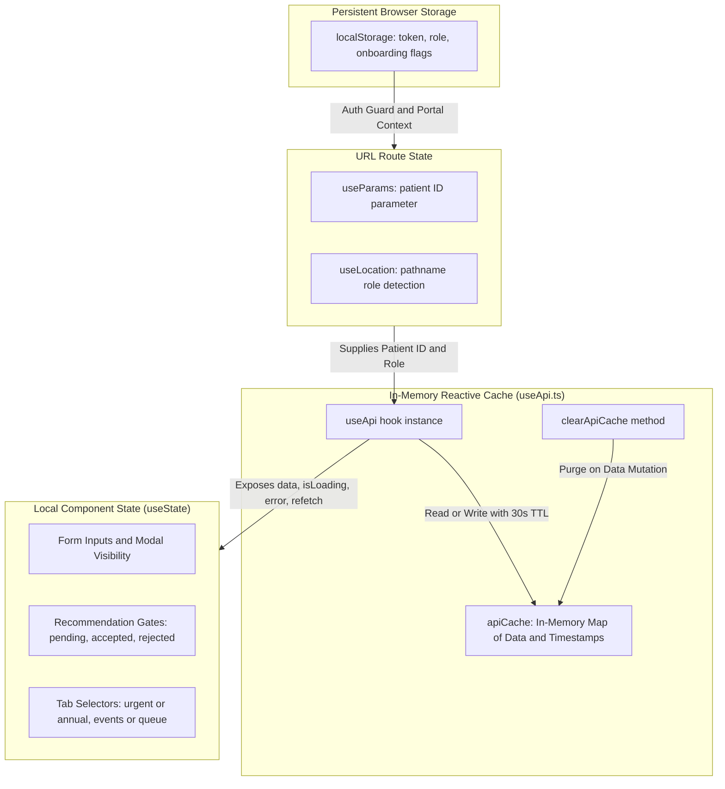

# SleepCare Dashboard — State Management & Data Flow

> **Key Implementations:**  
> - Reactive Data Hook: [`src/app/hooks/useApi.ts`](file:///c:/Users/mahmed/Downloads/SleepCare-Dashboard/src/app/hooks/useApi.ts)  
> - In-Memory Cache: `apiCache` in [`useApi.ts`](file:///c:/Users/mahmed/Downloads/SleepCare-Dashboard/src/app/hooks/useApi.ts#L13)  
> - LocalStorage State: User session (`token`, `role`) & onboarding flags

---

## 1. State Architecture Overview

The SleepCare dashboard deliberately avoids complex, heavy state containers like Redux, Zustand, or MobX. Instead, the application relies on an **asynchronous reactive server-state cache (`useApi`)** coupled with URL route state and browser `localStorage`.



---

## 2. Server State & The `useApi` Caching Engine

All remote data queries are mediated through the [`useApi`](file:///c:/Users/mahmed/Downloads/SleepCare-Dashboard/src/app/hooks/useApi.ts#L28-L118) hook.

### Hook Signature & Options

```typescript
interface UseApiOptions<T> {
  initialData?: T;
  dependencies?: any[];
  onSuccess?: (data: T) => void;
  onError?: (error: Error) => void;
  cacheKey?: string;
  cacheTime?: number; // Cache validity duration in ms. Defaults to 30000 (30 seconds).
}

export function useApi<T>(
  apiCall: () => Promise<T>,
  options: UseApiOptions<T> = {}
): {
  data: T | undefined;
  isLoading: boolean;
  error: Error | null;
  refetch: (silent?: boolean) => Promise<void>;
  setData: React.Dispatch<React.SetStateAction<T | undefined>>;
}
```

### Cache Mechanics

1. **In-Memory Store**: A module-scoped hash map stores results by key:
   ```typescript
   const apiCache: Record<string, { data: any; timestamp: number }> = {};
   ```
2. **Instant Cache Resolution**: On component mount, if a valid entry exists within `cacheTime` (default 30s), it is returned synchronously to `useState`, rendering the UI immediately without flickering or loading spinners.
3. **Background Validation & Force Refresh**: Calling `refetch()` or `refetch(silent = true)` bypasses the cache timestamp, triggers a fresh network query, updates the cache, and re-renders consumers.
4. **Cache Invalidation**:
   ```typescript
   export function clearApiCache(key?: string) {
     if (key) {
       delete apiCache[key];
     } else {
       Object.keys(apiCache).forEach(k => delete apiCache[k]);
     }
   }
   ```
   Invoked after data mutations (e.g. submitting a survey or changing equipment) to guarantee fresh responses.

---

## 3. Persistent LocalStorage State

| Key Name | Values | Managed By | Purpose |
|---|---|---|---|
| `token` | String (JWT token) | [`PatientLogin`](file:///c:/Users/mahmed/Downloads/SleepCare-Dashboard/src/app/pages/auth/PatientLogin.tsx), [`PhysicianLogin`](file:///c:/Users/mahmed/Downloads/SleepCare-Dashboard/src/app/pages/auth/PhysicianLogin.tsx), [`TechnicianLogin`](file:///c:/Users/mahmed/Downloads/SleepCare-Dashboard/src/app/pages/auth/TechnicianLogin.tsx) | Attached to API request headers. Cleared on 401 or logout. |
| `role` | `'patient' \| 'physician' \| 'technician'` | Login components & layout guards | Determines permissions and directs route navigation. |
| `has-visited-dashboard-{id}` | `'true'` | [`PatientHome`](file:///c:/Users/mahmed/Downloads/SleepCare-Dashboard/src/app/pages/patient/Home.tsx#L75) | Tracks onboarding step 1 completion. |
| `has-visited-sleep-{id}` | `'true'` | [`PatientCPAP`](file:///c:/Users/mahmed/Downloads/SleepCare-Dashboard/src/app/pages/patient/CPAP.tsx#L23) | Tracks onboarding step 2 completion. |
| `has-visited-equipment-{id}` | `'true'` | [`PatientInterventions`](file:///c:/Users/mahmed/Downloads/SleepCare-Dashboard/src/app/pages/patient/Interventions.tsx#L12) | Tracks onboarding step 3 completion. |
| `has-visited-surveys-{id}` | `'true'` | [`PatientSurveys`](file:///c:/Users/mahmed/Downloads/SleepCare-Dashboard/src/app/pages/patient/Surveys.tsx#L62) | Tracks onboarding step 4 completion. |
| `has-visited-videos-{id}` | `'true'` | [`PatientVideos`](file:///c:/Users/mahmed/Downloads/SleepCare-Dashboard/src/app/pages/patient/Videos.tsx#L56) | Tracks onboarding step 5 completion. |
| `has-watched-video-{id}` | `'true'` | [`CoachingVideoModal`](file:///c:/Users/mahmed/Downloads/SleepCare-Dashboard/src/app/components/CoachingVideoModal.tsx) | Local fallback ensuring video watch progress is saved if offline. |

> [!NOTE]
> **Layout Role Guard Variations**:
> While `role` is persisted in `localStorage`, layouts enforce it differently:
> - [`PhysicianLayout`](file:///c:/Users/mahmed/Downloads/SleepCare-Dashboard/src/app/layouts/PhysicianLayout.tsx#L16-L21) and [`TechnicianLayout`](file:///c:/Users/mahmed/Downloads/SleepCare-Dashboard/src/app/layouts/TechnicianLayout.tsx#L17-L22) perform active mount-time role assertion guards (`if (role !== '...') navigate(...)`).
> - [`PatientLayout`](file:///c:/Users/mahmed/Downloads/SleepCare-Dashboard/src/app/layouts/PatientLayout.tsx) does **not** perform this mount-time check, relying instead on route parameterization (`/patient/:id`) and the unparameterized `/patient -> /login` route redirect.

---

## 4. URL & Route State

Routing parameters drive patient scoping without props drilling:

- **Patient Identification (`useParams().id`)**:
  - Captured in layouts ([`PhysicianPatientLayout`](file:///c:/Users/mahmed/Downloads/SleepCare-Dashboard/src/app/layouts/PhysicianPatientLayout.tsx), [`TechnicianPatientLayout`](file:///c:/Users/mahmed/Downloads/SleepCare-Dashboard/src/app/layouts/TechnicianPatientLayout.tsx), [`PatientLayout`](file:///c:/Users/mahmed/Downloads/SleepCare-Dashboard/src/app/layouts/PatientLayout.tsx)).
  - Automatically fed into `useApi` cache keys (e.g. `patient-summary-${id}`, `cpap-trends-7-${id}`).
- **Role Detection (`useLocation().pathname`)**:
  - In polymorphic pages like [`PatientDirectory`](file:///c:/Users/mahmed/Downloads/SleepCare-Dashboard/src/app/pages/shared/Directory.tsx) and [`UniversalInterventions`](file:///c:/Users/mahmed/Downloads/SleepCare-Dashboard/src/app/pages/shared/UniversalInterventions.tsx), `pathname.includes('/technician')` switches button actions and detail routes dynamically.

---

## 5. Background Polling Timers & Real-Time Sync

The application uses targeted background timers for critical live data:

1. **Patient Real-Time Coaching Video Delivery ([`PatientHome.tsx:L64-L72`](file:///c:/Users/mahmed/Downloads/SleepCare-Dashboard/src/app/pages/patient/Home.tsx#L64-L72))**:
   - Polling frequency: **3000ms**.
   - Polls `refetchSummary`, `refetchTrends`, `refetchSurveys`, and `refetchVideos`.
   - When a new prescription or severe mask leak is detected, triggers the video pop-up immediately.
2. **Backend Connectivity Health Check ([`ConnectivityStatus.tsx:L23`](file:///c:/Users/mahmed/Downloads/SleepCare-Dashboard/src/app/components/ui/ConnectivityStatus.tsx#L23))**:
   - Polling frequency: **30000ms (30s)**.
   - Pings `GET /health` to update the global network status pill.
3. **ML Model Retraining Watcher ([`AILifecyclePanel.tsx:L56`](file:///c:/Users/mahmed/Downloads/SleepCare-Dashboard/src/app/components/AILifecyclePanel.tsx#L56))**:
   - Polling frequency: **4000ms (4s)**.
   - Active only while a model's status is `'retraining'` to detect when new weights are deployed.

---

## 6. Form State & User Input Flow

All forms utilize controlled React state:
- **Triage Decision**: In [`TechnicianHome.tsx`](file:///c:/Users/mahmed/Downloads/SleepCare-Dashboard/src/app/pages/technician/Home.tsx#L82-L100), `isSubmitting`, `dismissingId`, and `dismissReason` hold dismiss feedback before dispatching `submitEventTriage`.
- **Clinical Orders**: In [`SummaryContent.tsx`](file:///c:/Users/mahmed/Downloads/SleepCare-Dashboard/src/app/components/SummaryContent.tsx#L86-L97), `clinicalNotes` and `activePathway` feed into `createIntervention` or `createAuthorization`.
- **Survey Completion**: In [`PatientSurveys.tsx`](file:///c:/Users/mahmed/Downloads/SleepCare-Dashboard/src/app/pages/patient/Surveys.tsx), user answers are accumulated in an object map `Record<number, any>` and submitted via `submitSurveyResponse`.
